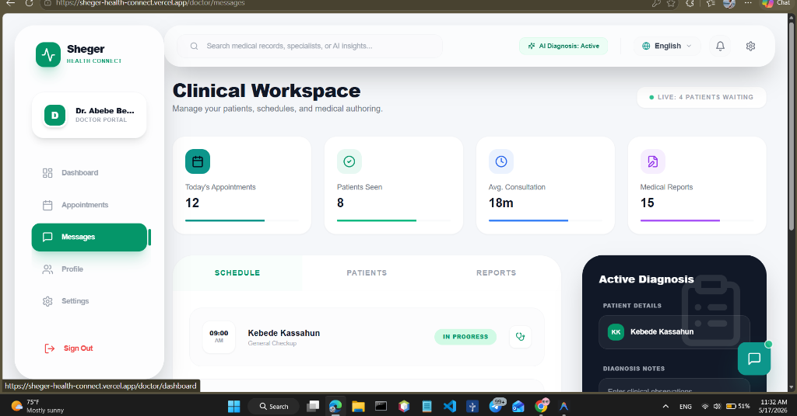
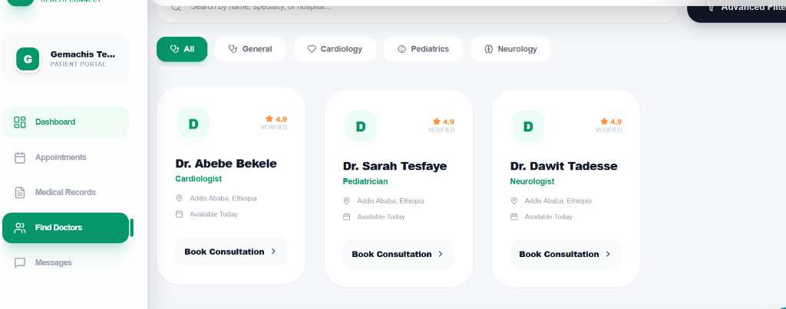
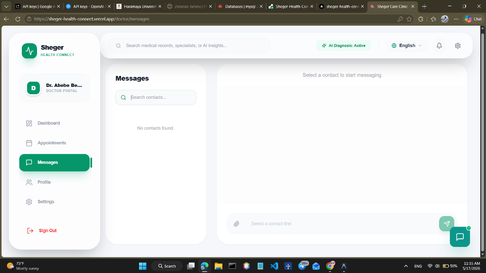
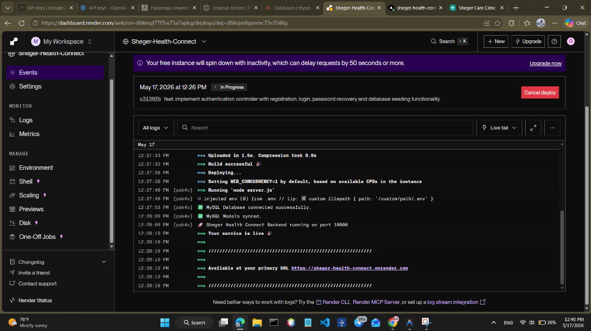
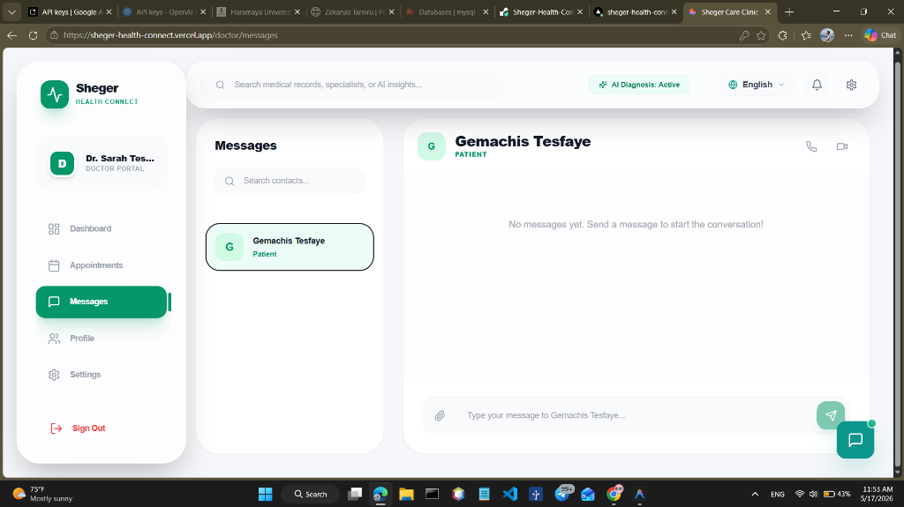
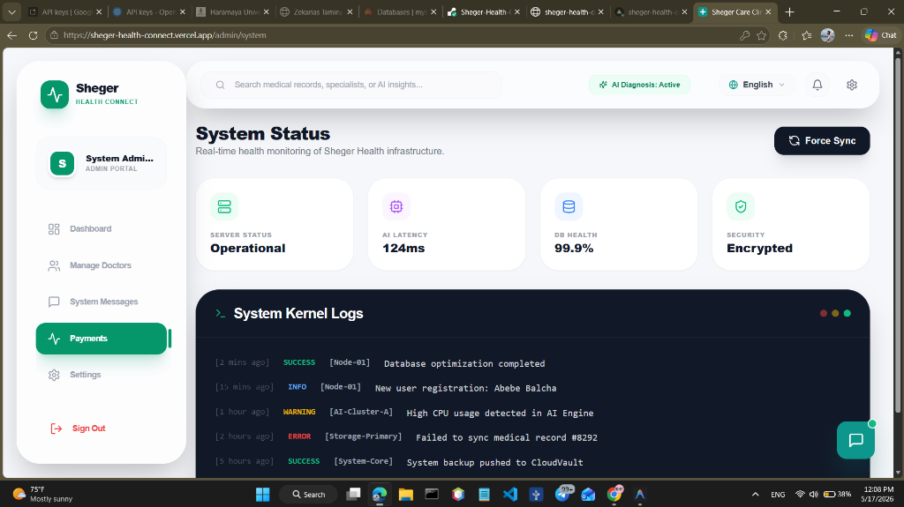

# 🏥 Sheger Health Connect

<a href="https://sheger-health-connect.onrender.com" target="_blank">
  
</a>

## 🌐 Live Deployment
* **Backend Deployed API (Render)**: [sheger-health-connect.onrender.com](https://sheger-health-connect.onrender.com)
* **Frontend App (Vercel)**: [sheger-health-connect.vercel.app](https://sheger-health-connect.vercel.app)

---

## 🛡️ Security Architecture
Sheger Health prioritizes patient data safety with a multi-layered security approach:
- **No Public Registration**: Prevents unauthorized access. All user accounts (Doctors/Patients) are created and vetted by the System Administrator.
- **Advanced Encryption**: All passwords undergo **bcrypt** salted hashing before storage. Plaintext passwords are never stored or logged.
- **JWT Authentication**: Secure, stateless session management using JSON Web Tokens (24h expiration).
- **Role-Based Access Control (RBAC)**: Strict separation of privileges. Doctors cannot access admin panels, and patients can only access their personal medical records.
- **SQL Injection Protection**: All database queries are handled via **Sequelize ORM**, using prepared statements and parameterized queries.
- **CORS Protection**: Access-Control headers are restricted to authorized frontend origins only.

---

## 📸 Platform Experiences (Interactive Screenshots Grid)

| 🏠 Public Landing Page | 🔑 Authentication Gateway | 🌍 About Clinical Tech |
| :---: | :---: | :---: |
|  |  |  |
| **👤 Patient Portal** | **🩺 Doctor Portal** | **💬 Doctor Personal Chats** |
|  |  |  |
| **📅 Doctor Schedule Workspace** | **🔑 Admin Dashboard Overview** | **🔑 Admin Doctor Manager** |
|  |  |  |

---

## 🚀 Key Features & Architectural Milestones

### 👤 User Roles & Dashboard Spaces
- **🔑 Admin Portal**: Full control over onboarded Doctors/Patients lists, detailed real-time clinical logs, system analytics, and billing transactions tracking.
- **🩺 Doctor Workspace**: Private workspace to manage client schedules, view assigned patients' detailed health histories, and secure messaging channels.
- **👤 Patient Workspace**: Secure interface to search for active specialists, manage clinical appointments, and retrieve health summarizing records.

### 🛠️ Core Functional Modules
- **💬 Isolated Direct Messaging**: Advanced message router that separates Direct Messaging (DM) and Group Chats. Fixed data leaks so that patient-doctor clinical discussions are end-to-end isolated.
- **🤕 Interactive Symptoms Checker**: A high-fidelity frontend quick checker that guides patients through standard symptoms and recommends the correct board-certified specialist instantly.
- **🚪 Logout Session Confirmation**: Secure session preservation tool that prevents accidental sign-outs with professional modals.
- **🧼 Clean Seeder Tool**: Updated DB-seed scripts to automatically clear messaging logs, keeping workspace test-data fully clean.
- **🧠 Medical GPT-4 AI Triage**: Robust AI consultation helper with smart fallback triggers for high platform availability.
- **🌐 Dual Multilingual Support**: Live language toggles offering flawless transitions between English, Amharic, and Afaan Oromoo across all components.

---

## 💻 Tech Stack & Developer Tools

### Frontend Core
* **React.js (Vite)**: High-performance single-page app framework.
* **Tailwind CSS & Vanilla CSS**: Unified aesthetic design tokens using custom HSL themes.
* **Framer Motion**: Modern spring animations and micro-interaction effects.
* **i18next**: Strict internationalization framework for local language support.
* **Lucide React**: Premium medical and dashboard iconography.

### Backend Infrastructure
* **Node.js & Express**: Clean MVC server-side REST API.
* **Sequelize (ORM)**: Prepared statements, security constraints, and database structure.
* **MySQL**: Robust relational database engine.
* **Socket.io**: Real-time two-way client communication for instant message events.
* **OpenAI SDK**: Clinical triage GPT-4 integrations.

---

## ⚙️ Local Setup & Installation

### 1. Prerequisites
* Node.js (v18+)
* MySQL Server instance running

### 2. Backend Setup
```bash
cd backend
npm install
# Configure your local .env with DB credentials and OpenAI Keys
npm run dev
```

### 3. Frontend Setup
```bash
cd frontend
npm install
npm run dev
```

### 4. Admin Seeding
To register the default administrator:
```bash
cd backend
node seed-admin.js
```
* **Default Admin Credentials**: Username: `admin` | Password: `Admin@2026`

---

© 2026 Sheger Health. Designed & Developed by Gemachis Tesfaye. All rights reserved.
