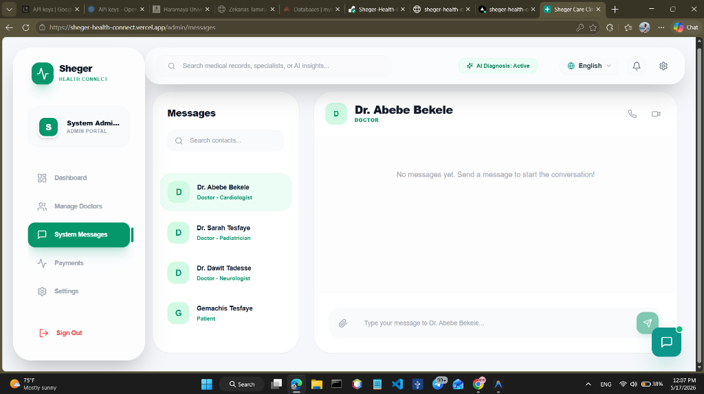
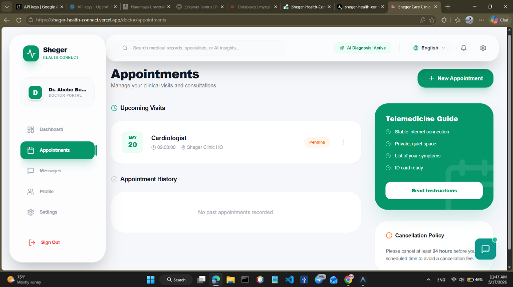
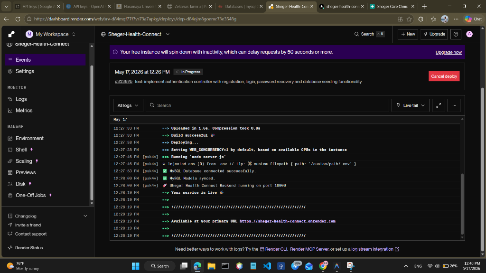

# 🏥 Sheger Health Connect


> [!IMPORTANT]
> **Status**: Production Ready. Key features like **Direct Messaging Privacy**, **Interactive Triage Selector**, **Logout Session Confirmation**, and **Clean Database Seeder Utilities** are fully completed, tested, and built.

## 🛡️ Security Architecture
Sheger Health prioritizes patient data safety with a multi-layered security approach:
- **No Public Registration**: Prevents unauthorized access. All user accounts (Doctors/Patients) are created and vetted by the System Administrator.
- **Advanced Encryption**: All passwords undergo **bcrypt** salted hashing before storage. Plaintext passwords are never stored or logged.
- **JWT Authentication**: Secure, stateless session management using JSON Web Tokens (24h expiration).
- **Role-Based Access Control (RBAC)**: Strict separation of privileges. Doctors cannot access admin panels, and patients can only access their personal medical records.
- **SQL Injection Protection**: All database queries are handled via **Sequelize ORM**, using prepared statements and parameterized queries.
- **CORS Protection**: Access-Control headers are restricted to authorized frontend origins only.

## 🚀 Key Features

### 👤 User Roles

#### 🔑 Admin Dashboard
Full control over user onboarding (Doctors/Patients), system monitoring, and financial tracking.


#### 🩺 Doctor Portal
Personalized clinical workspace to manage appointments, view assigned patients, and communicate with administration.


#### 👤 Patient Portal
Secure portal to browse specialists, book consultations, and interact with the AI Triage Assistant.


### 🛠️ Core Modules
- **Doctor Management**: Integrated onboarding system with hashed credentials and specialization mapping.
- **AI Triage Assistant**: Intelligent health advisor (powered by GPT-4) with local fallback support for continuous availability.
- **System Logs**: Real-time monitoring of server health, database connectivity, and security events.
- **Payment Tracking**: Hospital revenue management system for tracking patient transactions.

## 💻 Tech Stack & Tools

### Frontend
- **React.js**: Core framework for the user interface.
- **Tailwind CSS**: Modern utility-first styling for premium design.
- **Framer Motion**: Smooth, high-fidelity animations and transitions.
- **Lucide React**: Crisp, modern iconography for a SaaS feel.
- **Recharts**: Data visualization for Admin metrics.
- **i18next**: Multilingual support (English, Amharic, Afaan Oromo).
- **React Router**: Client-side navigation and role-based route protection.

### Backend
- **Node.js & Express**: Scalable server-side logic and RESTful API.
- **Sequelize (ORM)**: Secure database management and schema migrations.
- **MySQL**: Relational database for persistent user and medical data.
- **Socket.io**: Real-time bidirectional communication for system events.
- **OpenAI Node SDK**: Integration with GPT-4 for the AI Triage Assistant.
- **bcrypt & JWT**: Industry-standard security for passwords and sessions.

## ⚙️ Setup & Installation

### 1. Prerequisites
- Node.js (v18+)
- MySQL Server

### 2. Backend Setup
```bash
cd backend
npm install
# Configure .env with your DB credentials and OpenAI Key
npm run dev
```

### 3. Frontend Setup
```bash
cd frontend
npm install
npm run dev
```

### 4. Seeding Admin
To create the initial system administrator, run:
```bash
cd backend
node seed-admin.js
```
**Default Admin**: `admin` / `Admin@2026`

## 📊 System Architecture
The application uses a modular MVC-style architecture on the backend with a clear separation of concerns between models, controllers, and routes. The frontend follows a component-based design with centralized state management via `AuthContext`.

---
### 🚧 Current Development Note
This system is **NOT YET FINISHED**. Active development is focused on:
- **AI Chatbot**: Full API integration and advanced multi-language triage.
- **SMS Gateway**: Integration for patient alerts and reminders.
- **Production Hardening**: Security audits and deployment scripts.

© 2026 Sheger Health. Developed by Gemachis Tesfaye.
